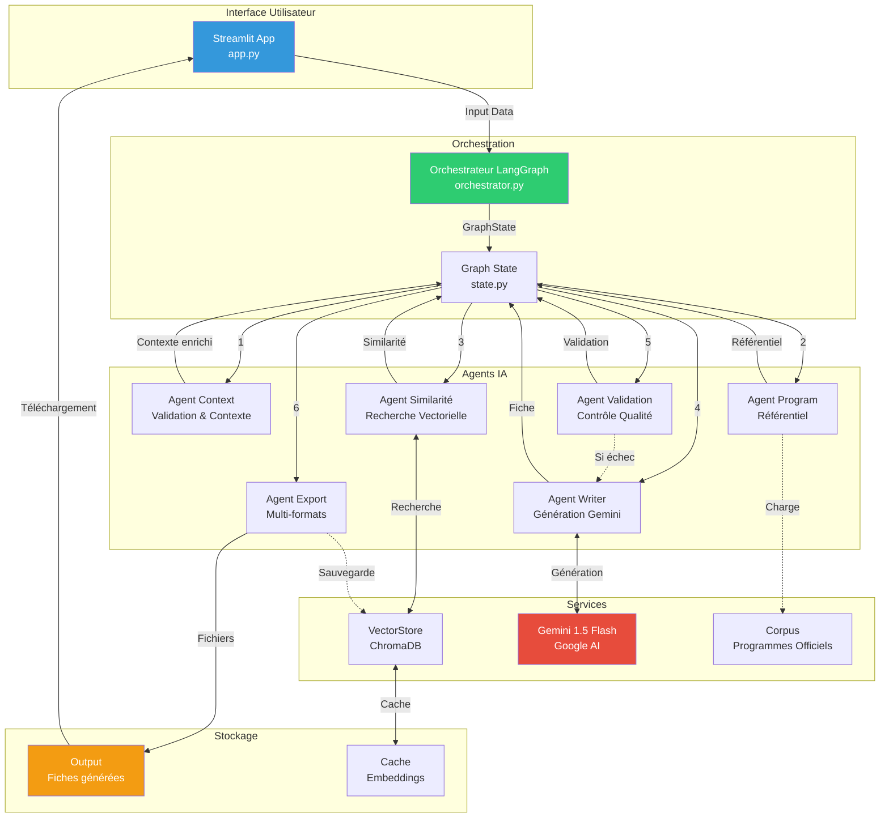
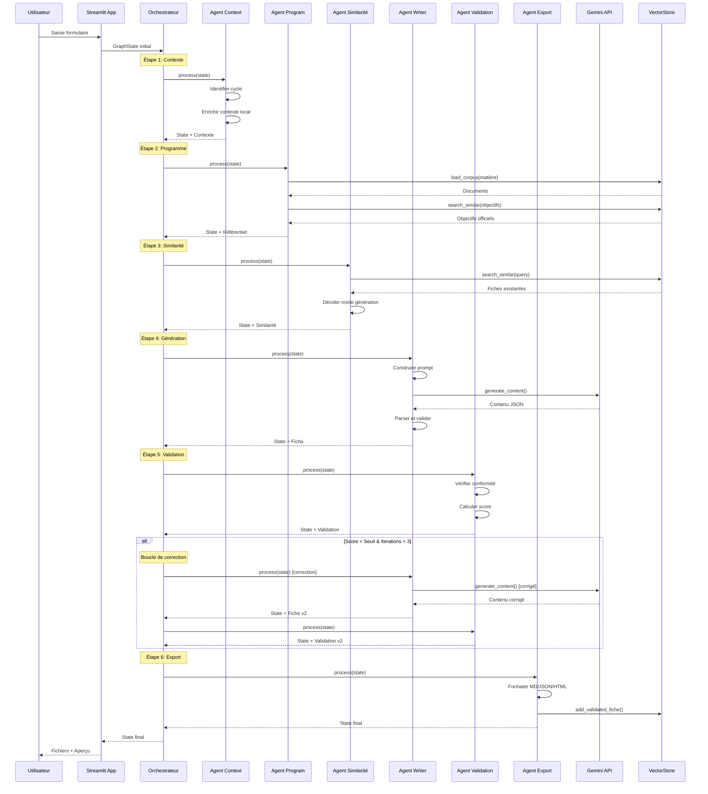
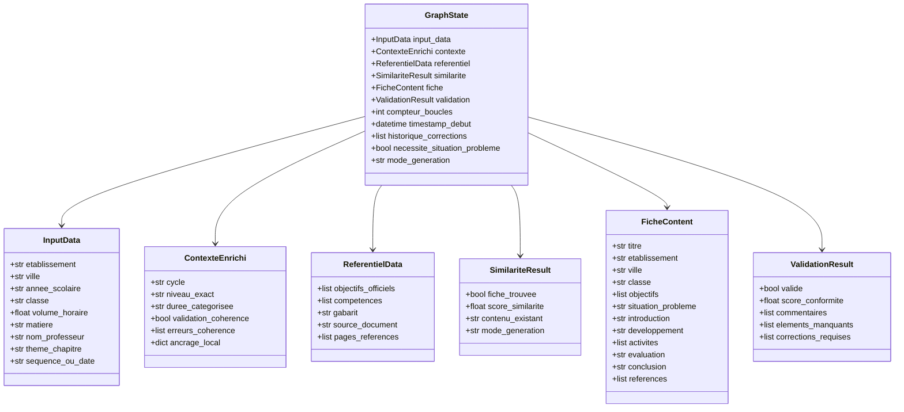
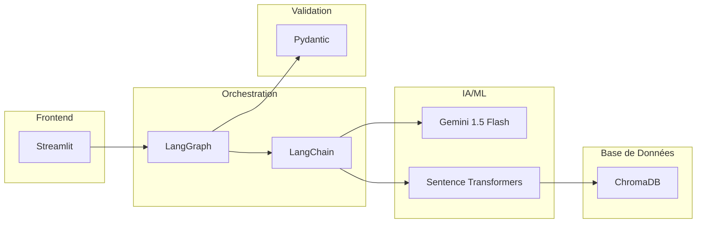
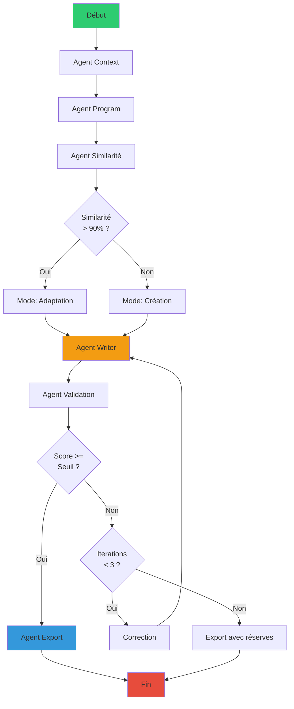

# 🏗️ Architecture du Système Multi-Agents

## Vue d'Ensemble



## Flux de Données Détaillé



## Architecture des Agents

### Agent Context
```
┌─────────────────────────────┐
│     AGENT CONTEXT           │
├─────────────────────────────┤
│ Entrées:                    │
│  • InputData                │
├─────────────────────────────┤
│ Traitements:                │
│  • Identifier cycle         │
│  • Catégoriser durée        │
│  • Valider cohérence        │
│  • Enrichir ancrage local   │
├─────────────────────────────┤
│ Sorties:                    │
│  • ContexteEnrichi          │
│  • Flags (situation-pb)     │
└─────────────────────────────┘
```

### Agent Program
```
┌─────────────────────────────┐
│     AGENT PROGRAM           │
├─────────────────────────────┤
│ Entrées:                    │
│  • Matière, Thème, Niveau   │
├─────────────────────────────┤
│ Services:                   │
│  • VectorStore              │
│  • Corpus (PDFs/TXT)        │
├─────────────────────────────┤
│ Traitements:                │
│  • Charger corpus           │
│  • Extraire objectifs       │
│  • Déterminer gabarit       │
├─────────────────────────────┤
│ Sorties:                    │
│  • ReferentielData          │
└─────────────────────────────┘
```

### Agent Similarité
```
┌─────────────────────────────┐
│     AGENT SIMILARITÉ        │
├─────────────────────────────┤
│ Entrées:                    │
│  • Query (thème+objectifs)  │
├─────────────────────────────┤
│ Services:                   │
│  • VectorStore + Cache      │
│  • Embeddings               │
├─────────────────────────────┤
│ Traitements:                │
│  • Recherche vectorielle    │
│  • Calcul similarité        │
│  • Décision adaptation/création │
├─────────────────────────────┤
│ Sorties:                    │
│  • SimilariteResult         │
│  • Mode génération          │
└─────────────────────────────┘
```

### Agent Writer
```
┌─────────────────────────────┐
│     AGENT WRITER            │
├─────────────────────────────┤
│ Entrées:                    │
│  • Contexte + Référentiel   │
│  • Mode (création/adaptation) │
│  • Feedback (si correction) │
├─────────────────────────────┤
│ Services:                   │
│  • Gemini 1.5 Flash API     │
├─────────────────────────────┤
│ Traitements:                │
│  • Construire prompt        │
│  • Générer contenu          │
│  • Parser JSON              │
│  • Ancrer localement        │
├─────────────────────────────┤
│ Sorties:                    │
│  • FicheContent             │
└─────────────────────────────┘
```

### Agent Validation
```
┌─────────────────────────────┐
│     AGENT VALIDATION        │
├─────────────────────────────┤
│ Entrées:                    │
│  • FicheContent             │
│  • Référentiel              │
├─────────────────────────────┤
│ Vérifications:              │
│  • Champs obligatoires      │
│  • Situation-problème       │
│  • Objectifs pédagogiques   │
│  • Structure gabarit        │
├─────────────────────────────┤
│ Calculs:                    │
│  • Score conformité         │
│  • Comparaison seuil        │
├─────────────────────────────┤
│ Sorties:                    │
│  • ValidationResult         │
│  • Corrections requises     │
└─────────────────────────────┘
```

### Agent Export
```
┌─────────────────────────────┐
│     AGENT EXPORT            │
├─────────────────────────────┤
│ Entrées:                    │
│  • FicheContent validée     │
├─────────────────────────────┤
│ Traitements:                │
│  • Formater Markdown        │
│  • Formater JSON            │
│  • Formater HTML            │
│  • Ajouter métadonnées      │
├─────────────────────────────┤
│ Actions:                    │
│  • Sauvegarder fichiers     │
│  • Indexer dans VectorStore │
├─────────────────────────────┤
│ Sorties:                    │
│  • 3 fichiers (MD/JSON/HTML)│
└─────────────────────────────┘
```

## Modèle de Données (State)



## Technologies Utilisées



## Décisions de Routage



## Optimisations Techniques

### 1. Cache des Embeddings
```
Embedding(texte) 
    ↓
Hash(texte) → Cache JSON
    ↓
Si présent: return cache[hash]
Sinon: calcule + sauvegarde
```

### 2. Hiérarchie des Sources
```
Documents Corpus:
  Priority 1: type="officiel"
  Priority 2: type="complement"
  
Tri: (priority, -score_similarité)
```

### 3. Boucle de Correction
```
MAX_LOOPS = 3

for i in range(MAX_LOOPS):
    fiche = generate()
    score = validate(fiche)
    
    if score >= threshold:
        break
    
    feedback = create_feedback(score)
    
return fiche  # Meilleure version
```

---

**Cette architecture garantit:**
- ✅ Séparation des responsabilités
- ✅ Modularité et extensibilité
- ✅ Performance optimisée
- ✅ Qualité pédagogique
- ✅ Traçabilité complète
